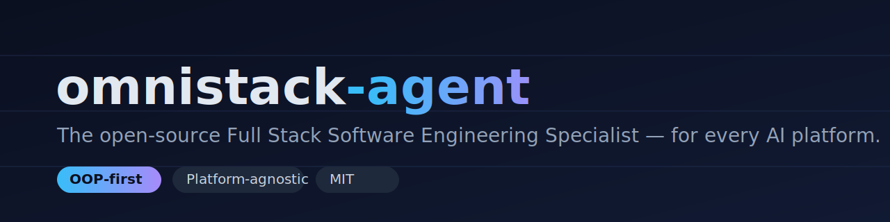

 ·  · 

**[🇺🇸 Read in English](README.md)**

## O que é isto

**omnistack-agent** é um prompt de sistema open-source e independente de plataforma que transforma qualquer modelo de IA capaz em um **Especialista em Engenharia de Software Full Stack** — um único agente que assume com naturalidade o papel de engenharia que a tarefa exigir, tendo o design orientado a objetos como sua lente padrão. O "cérebro" do agente é escrito uma única vez em uma fonte única (`core/` + `knowledge/`) e compilado por um script Node testado e sem dependências em arquivos adaptadores prontos para uso em todas as principais plataformas de IA. Você não escreve prompts — você copia um arquivo.

Ele pode assumir todos estes dez papéis:

- **Arquiteto de Software** — estrutura do sistema, fronteiras e trade-offs (com ADRs).
- **Desenvolvedor Full Stack** — funcionalidades ponta a ponta entre UI, API e dados.
- **Desenvolvedor Mobile** — apps nativos e multiplataforma, offline e push.
- **Engenheiro Backend** — lógica de domínio, serviços, jobs e integridade dos dados.
- **Engenheiro Frontend** — interfaces acessíveis e performáticas, com estado previsível.
- **Administrador de Banco de Dados** — esquemas, indexação, migrações e tuning.
- **Engenheiro DevOps** — CI/CD, Infraestrutura como Código e rollbacks.
- **Engenheiro de QA** — planos de teste, suítes automatizadas e relatórios de bug precisos.
- **Redator Técnico** — READMEs, referências de API e documentos de arquitetura.
- **Mentor de Software** — o *porquê* por trás do código, com exemplos executáveis.

## ▶️ Como usar

Escolha sua plataforma, copie o conteúdo do arquivo indicado e cole onde a plataforma espera suas instruções. Nenhum passo de build é necessário para consumir o agente — os adaptadores já vêm gerados e versionados.

| Plataforma | Arquivo para copiar | Como instalar |
| --- | --- | --- |
| **ChatGPT** (Custom GPT) | [`adapters/chatgpt/custom-gpt-instructions.md`](adapters/chatgpt/custom-gpt-instructions.md) | Crie um novo GPT → abra **Configure** → cole o arquivo na caixa **Instructions**. Para uma variante mais enxuta com todo o conhecimento, use [`adapters/chatgpt/system-prompt.md`](adapters/chatgpt/system-prompt.md). |
| **Claude** (Skill) | [`adapters/claude/SKILL.md`](adapters/claude/SKILL.md) | Coloque o arquivo na pasta de skills do seu projeto (ex.: `.claude/skills/omnistack-agent/SKILL.md`); ele já vem com frontmatter YAML e é invocável pelo usuário. |
| **Claude** (Agent) | [`adapters/claude/agent.md`](adapters/claude/agent.md) | Registre-o como subagente em `.claude/agents/`; o frontmatter já define nome, descrição e modelo. Para orientação de repositório inteiro, use [`adapters/claude/AGENTS.md`](adapters/claude/AGENTS.md). |
| **GitHub Copilot** | [`adapters/copilot/copilot-instructions.md`](adapters/copilot/copilot-instructions.md) | Salve como `.github/copilot-instructions.md` na raiz do repositório → recarregue o Copilot. |
| **Gemini** (Gem) | [`adapters/gemini/gem-instructions.md`](adapters/gemini/gem-instructions.md) | Crie um novo Gem no Gemini → cole o arquivo no campo **Instructions** → salve. |
| **Cursor / Windsurf** | [`adapters/cursor/AGENTS.md`](adapters/cursor/AGENTS.md) | Coloque como `AGENTS.md` na raiz do projeto para que o editor o reconheça automaticamente. |
| **Genérico** (qualquer LLM) | [`adapters/generic/system-prompt.md`](adapters/generic/system-prompt.md) | Cole o arquivo como **system prompt** de qualquer chat ou requisição de API (OpenAI, Anthropic, modelos locais, etc.). |

> Os passos completos por plataforma, com detalhamento, estão em [`docs/platforms.md`](docs/platforms.md).

## 🤝 Como contribuir

Contribuições são bem-vindas — novos módulos de conhecimento, sementes de linguagens, correções e traduções ajudam muito. Existe **uma regra de ouro**:

> **Edite `core/` ou `knowledge/` — nunca edite `adapters/`.** Os arquivos adaptadores são *gerados*. Edições manuais são sobrescritas pelo próximo build e rejeitadas pela CI.

O fluxo de trabalho:

1. **Edite a fonte.** Altere um arquivo numerado em `core/`, ou adicione/atualize um módulo em `knowledge/` (e linke-o em `knowledge/_index.md`).
2. **Regerar os adaptadores.** Rode `npm run build` para regenerar todos os arquivos em `adapters/`.
3. **Verifique.** Rode `node --test` (testes unitários) e `npm run validate` (confirma que os adaptadores batem com a fonte).
4. **Abra um PR.** A CI roda `npm run validate`, então um PR falha se os adaptadores versionados divergirem de `core/` + `knowledge/`. Sempre versione os adaptadores regerados junto da sua mudança na fonte.

Requisitos: **Node ≥ 18**, zero dependências npm. Veja [`CONTRIBUTING.md`](CONTRIBUTING.md) para o guia completo, incluindo o template de módulo de conhecimento e as convenções de commit.

## 🗂️ Estrutura do repositório

```text
omnistack-agent/
├── core/        # O cérebro do agente (fonte única): identidade, princípios,
│                #   capacidades, fluxo de trabalho, estilo de interação, guardrails.
├── knowledge/   # Base de conhecimento modular — um tópico por arquivo Markdown,
│                #   indexada por knowledge/_index.md.
├── adapters/    # Saída GERADA por plataforma. Não edite à mão.
├── scripts/     # Build Node sem dependências (build.mjs), validate que detecta
│                #   divergência (validate.mjs), lib pura + testes.
├── docs/        # Guias: arquitetura, adicionar conhecimento, plataformas.
└── assets/      # Banner e outras mídias estáticas.
```

## 🛣️ Roadmap

- Mais linguagens e frameworks em `knowledge/` (Python, Go, Rust, Vue, Angular, .NET MAUI e outros).
- Adaptadores para novas plataformas conforme surgirem novas ferramentas de IA.
- Uma pasta `examples/` curada com prompts reais e as respostas do agente.
- Uma tradução completa dos módulos de conhecimento para o português (o README e os docs já são bilíngues).
- Módulos mais profundos por domínio, expandindo as sementes em referências completas.

## 📄 Licença

Distribuído sob a **Licença MIT** — livre para usar, modificar e distribuir. Veja [`LICENSE`](LICENSE).
